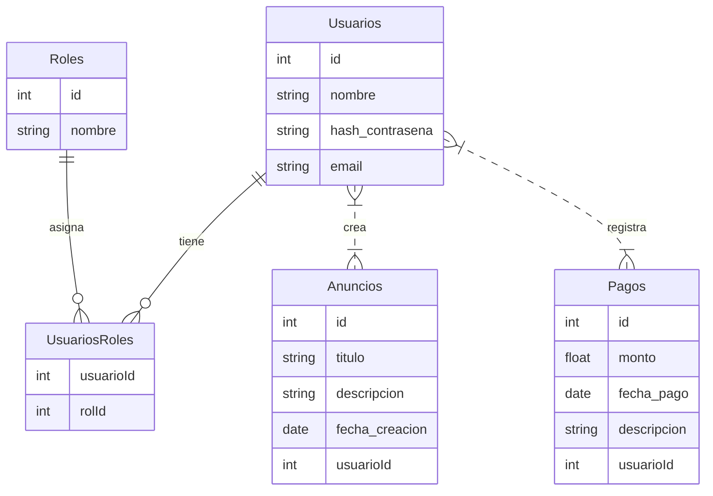
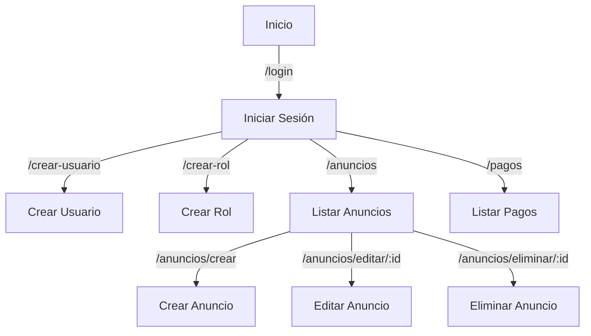

# Gestor de propiedades

## Requerimientos

### Flask

Para configurar y ejecutar la aplicación, sigue estos pasos rápidos:

1. **Crear un entorno virtual**:
   ```bash
   python -m venv nombre_entorno
   ```

2. **Activar el entorno virtual**:
   
   - Linux/Mac:
     ```bash
     source nombre_entorno/bin/activate
     ```
   - Windows:
     ```bash
     .\nombre_entorno\Scripts\activate
     ```
   
3. **Instalar los requerimientos**:
   Usando  `environment.yml` ubicado en la raíz de la app
   
   ```bash
   conda env create -f environment.yml
   ```
   
4. **Ejecutar la aplicación**:
   ```bash
   python run.py
   ```

¡Listo! Ahora deberías tener la aplicación corriendo localmente.

### BBDD

Creamos una nueva instancia de docker

```bash
docker run --detach --name gestorpropiedades-mariadb --env MARIADB_USER=daniel --env MARIADB_PASSWORD=MyPasword123 --env MARIADB_ROOT_PASSWORD=MyRootPasswd mariadb:latest
```

Conexión

```bash
mysql -h <ip_del_contenedor> -u <mariadb_user> -p
```

Ejecutamos el DDL

## Base de datos

### Diagrama ER


​    




### DDL

```sql
-- Crear tabla de Usuarios
CREATE TABLE Usuarios (
    id SERIAL PRIMARY KEY,
    nombre VARCHAR(255) NOT NULL,
    hash_contraseña VARCHAR(255) NOT NULL,
    email VARCHAR(255) UNIQUE NOT NULL
);

-- Crear tabla de Roles
CREATE TABLE Roles (
    id SERIAL PRIMARY KEY,
    nombre VARCHAR(50) UNIQUE NOT NULL
);

-- Crear tabla de relación UsuariosRoles
CREATE TABLE UsuariosRoles (
    usuarioId INT REFERENCES Usuarios(id),
    rolId INT REFERENCES Roles(id),
    PRIMARY KEY (usuarioId, rolId)
);

-- Crear tabla de Anuncios
CREATE TABLE Anuncios (
    id SERIAL PRIMARY KEY,
    titulo VARCHAR(255) NOT NULL,
    descripcion TEXT,
    fecha_creacion DATE DEFAULT CURRENT_DATE,
    usuarioId INT REFERENCES Usuarios(id)
);

-- Crear tabla de Pagos
CREATE TABLE Pagos (
    id SERIAL PRIMARY KEY,
    monto DECIMAL(10, 2) NOT NULL,
    fecha_pago DATE DEFAULT CURRENT_DATE,
    descripcion TEXT,
    usuarioId INT REFERENCES Usuarios(id)
);

-- Insertar roles predeterminados
INSERT INTO Roles (nombre) VALUES ('administrador'), ('vecino');
```

## App MVC con Flask

### Estructura del proyecto

```tex
Gestor_de_propiedades/
│
├── app/                     # Carpeta principal del proyecto
│   ├── models/              # Contiene los modelos de la base de datos (M del MVC)
│   │   ├── __init__.py
│   │   ├── usuario.py      # Modelo del usuario
│   │   ├── anuncio.py      # Modelo del anuncio
│   │   ├── pago.py         # Modelo del pago
│   │   └── ...             # Otros modelos si los hay
│   │
│   ├── views/              # Contiene las vistas (templates) (V del MVC)
│   │   ├── layout.html     # Plantilla base que incluye elementos comunes (ej. encabezado, pie de página)
│   │   ├── index.html      # Vista principal o dashboard
│   │   ├── anuncio.html    # Vista de un anuncio individual
│   │   ├── pagos.html      # Vista de pagos
│   │   └── ...             # Otras vistas si las hay
│   │
│   ├── controllers/        # Contiene la lógica del controlador (C del MVC)
│   │   ├── __init__.py
│   │   ├── main.py         # Controlador principal (rutas principales)
│   │   ├── anuncios.py     # Controlador para CRUD de anuncios
│   │   ├── pagos.py        # Controlador para CRUD de pagos
│   │   └── ...             # Otros controladores si los hay
│   │
│   ├── static/             # Archivos estáticos como CSS, JS, imágenes, etc.
│   │   ├── css/
│   │   ├── js/
│   │   └── img/
│   │
│   └── __init__.py         # Inicializa la aplicación y otras configuraciones
│
├── config.py               # Configuraciones de la aplicación (ej. configuración de la base de datos)
├── run.py                  # Script para ejecutar la aplicación
└── environment.yml         # Lista de dependencias del proyecto
```

### Rutas



#### Usuarios

**Iniciar Sesión**:

- **Ruta**: `/login`
- **Método**: GET, POST
- **Descripción**: Permite a los usuarios iniciar sesión en la aplicación.

**Crear Usuario:**

- **Ruta**: `/crear-usuario`
- **Método**: GET, POST
- **Descripción**: Permite crear un nuevo usuario.

#### Roles

**Crear Rol:**

- **Ruta**: `/crear-rol`
- **Método**: GET, POST
- **Descripción**: Permite crear un nuevo rol.

#### Anuncios

- **Listar Anuncios**:
  - **Ruta**: `/anuncios`
  - **Método**: GET
  - **Descripción**: Muestra la lista de anuncios.
- **Crear Anuncio**:
  - **Ruta**: `/anuncios/crear`
  - **Método**: GET, POST
  - **Descripción**: Permite crear un nuevo anuncio.
- **Editar Anuncio**:
  - **Ruta**: `/anuncios/editar/<int:id>`
  - **Método**: GET, POST
  - **Descripción**: Permite editar un anuncio existente según el ID proporcionado.
- **Eliminar Anuncio**:
  - **Ruta**: `/anuncios/eliminar/<int:id>`
  - **Método**: POST
  - **Descripción**: Permite eliminar un anuncio existente según el ID proporcionado.

#### Pagos

- Listar Pagos:
  - **Ruta**: `/pagos`
  - **Método**: GET
  - **Descripción**: Muestra la lista de pagos.